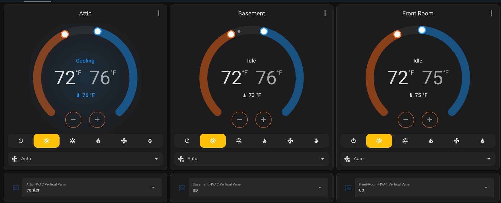

# esphome-mitsubishiheatpump

Wirelessly control your Mitsubishi Comfort HVAC equipment with an ESP8266 or
ESP32 using the [ESPHome](https://esphome.io) framework.

## What makes this branch unique
This is my personal branch where I've implemented dual-point thermostat support, along with multizone heating/cooling negotiation. This ensures that different units connected to a multi-split system consistently coordinate to request heating or cooling as required. See section titled "Automatic multizone heating/cooling negotiation".




## Features
* Instant feedback of command changes via RF Remote to HomeAssistant or MQTT.
* Direct control without the remote.
* Uses the [SwiCago/HeatPump](https://github.com/SwiCago/HeatPump) Arduino
  libary to talk to the unit directly via the internal `CN105` connector.

## Requirements
* https://github.com/SwiCago/HeatPump
* ESPHome 1.19.1 or greater

## Supported Microcontrollers
This library should work on most ESP8266 or ESP32 platforms. It has been tested
with the following MCUs:
* Generic ESP-01S board (ESP8266)
* WeMos D1 Mini (ESP8266)
* Generic ESP32 Dev Kit (ESP32)

## Supported Mitsubishi Climate Units
The underlying HeatPump library works with a number of Mitsubishi HVAC
units. Basically, if the unit has a `CN105` header on the main board, it should
work with this library. The [HeatPump
wiki](https://github.com/SwiCago/HeatPump/wiki/Supported-models) has a more
exhaustive list.

The same `CN105` connector is used by the Mitsubishi KumoCloud remotes, which
have a
[compatibility list](https://www.mitsubishicomfort.com/kumocloud/compatibility)
available.

The whole integration with this libary and the underlying HeatPump has been
tested by the author on the following units:
* `MSZ-GL06NA`
* `MFZ-KA09NA`

## Usage
### Step 1: Build a control circuit.

Build a control circuit with your MCU as detailed in the [SwiCago/HeatPump
 README](https://github.com/SwiCago/HeatPump/blob/master/README.md#demo-circuit).
You can use either an ESP8266 or an ESP32 for this.

Note: several users have reported that they've been able to get away with
not using the pull-up resistors, and just [directly connecting a Wemos D1 mini
to the control
board](https://github.com/SwiCago/HeatPump/issues/13#issuecomment-457897457)
via CN105.

### Step 2: Use ESPHome 1.18.0 or higher

The code in this repository makes use of a number of features in the 1.18.0
version of ESPHome, including various Fan modes and
[external components](https://esphome.io/components/external_components.html).

### Step 3: Add this repository as an external component

Add this repository to your ESPHome config:

```yaml
external_components:
  - source: github://geoffdavis/esphome-mitsubishiheatpump
```

#### Step 3a: Upgrading from 1.x releases

Version 2.0 and greater of this libary use the ESPHome `external_components`
feature, which is a huge step forward in terms of usability. In order to make
things compile correctly, you will need to:
1. Remove the `libraries` section that imports
   `https://github.com/SwiCago/HeatPump`, as this is handled by the
   `external_component` section of manifest.
2. Remove the `includes` section that imports `src/esphome-mitsubishiheatpump`
3. Delete the old checkout of this repository under
   `src/esphome-mitsubishiheatpump`.
4. Clean your old ESPHome build directories out (3-dot menu, "Clean Build
   Files")
5. You may also have to delete the _esphomenodename_ directory that
   corresponds with your _esphomenodename.yaml_ configuration file
   completely. This directory may exist in your base config directory,
   or in `config/.esphome/build`.  Testing with ESPHome 0.18.x showed this 
   to be necessary to get the cached copy of src/esphome-mitsubishiheatpump to
   go away entirely, as the "Clean Build Files" isn't as thorough as one would like.

*Note:* Failure to delete the old source directory and remove the `includes`
and `libraries` lines will likely result in compilation errors complaining
about duplicate declarations of `MitsubishiHeatPump::traits()`.

##### Example error
```
Linking /data/bedroom_east_heatpump/.pioenvs/bedroom_east_heatpump/firmware.elf
/root/.platformio/packages/toolchain-xtensa/bin/../lib/gcc/xtensa-lx106-elf/4.8.2/../../../../xtensa-lx106-elf/bin/ld: /data/bedroom_east_heatpump/.pioenvs/bedroom_east_heatpump/src/esphome/components/mitsubishi_heatpump/espmhp.cpp.o: in function `MitsubishiHeatPump::traits()':
espmhp.cpp:(.text._ZN18MitsubishiHeatPump6traitsEv+0x4): multiple definition of `MitsubishiHeatPump::traits()'; /data/bedroom_east_heatpump/.pioenvs/bedroom_east_heatpump/src/esphome-mitsubishiheatpump/espmhp.cpp.o:espmhp.cpp:(.text._ZN18MitsubishiHeatPump6traitsEv+0x80): first defined here
```

### Step 4: Configure the heatpump

Add a `mitsubishi_heatpump` to your ESPHome config:

```yaml
climate:
  - platform: mitsubishi_heatpump
    name: "My Heat Pump"

    # Optional
    hardware_uart: UART0
    baud_rate: 4800

    # Optional
    update_interval: 500ms
```

#### ESP8266 platforms

On ESP8266 you'll need to disable logging to serial because it conflicts with
the heatpump UART:

```yaml
logger:
  baud_rate: 0
```

#### ESP32 platforms

On ESP32 you can change `hardware_uart` to `UART1` or `UART2` and keep logging
enabled on the main serial port. This may require specifying `baud_rate` on some
ESP32 boards.

#### UART Notes

*Note:* this component DOES NOT use the ESPHome `uart` component, as it
requires direct access to a hardware UART via the Arduino `HardwareSerial`
class. The Mitsubishi Heatpump units use an atypical serial port setting ("even
parity").  Parity bit support is not implemented in any of the existing
software serial libraries, including the one in ESPHome. There's currently no
way to guarantee access to a hardware UART nor retrieve the `HardwareSerial`
handle from the `uart` component within the ESPHome framework.

# Example configurations

Below is an example configuration which will include wireless strength
indicators and permit over the air updates. You'll need to create a
`secrets.yaml` file inside of your `esphome` directory with entries for the
various items prefixed with `!secret`.

## ESP8266 Example Configuration

```yaml
substitutions:
  name: hptest
  friendly_name: Test Heatpump


esphome:
  name: ${name}
  platform: ESP8266
  board: esp01_1m
  # Boards tested: ESP-01S (ESP8266), Wemos D1 Mini (ESP8266); ESP32 Wifi-DevKit2

wifi:
  ssid: !secret wifi_ssid
  password: !secret wifi_password

  # Enable fallback hotspot (captive portal) in case wifi connection fails
  ap:
    ssid: "${friendly_name} Fallback Hotspot"
    password: !secret fallback_password

# Note: if upgrading from 1.x releases of esphome-mitsubishiheatpump, be sure
# to remove any old entries from the `libraries` and `includes` section.
#libraries:
  # Remove reference to SwiCago/HeatPump

#includes:
  # Remove reference to src/esphome-mitsubishiheatpump

captive_portal:

# Enable logging
logger:
  # ESP8266 only - disable serial port logging, as the HeatPump component
  # needs the sole hardware UART on the ESP8266
  baud_rate: 0

# Enable Home Assistant API
api:

ota:

# Enable Web server.
web_server:
  port: 80

  # Sync time with Home Assistant.
time:
  - platform: homeassistant
    id: homeassistant_time

# Text sensors with general information.
text_sensor:
  # Expose ESPHome version as sensor.
  - platform: version
    name: ${name} ESPHome Version
  # Expose WiFi information as sensors.
  - platform: wifi_info
    ip_address:
      name: ${name} IP
    ssid:
      name: ${name} SSID
    bssid:
      name: ${name} BSSID

# Sensors with general information.
sensor:
  # Uptime sensor.
  - platform: uptime
    name: ${name} Uptime

  # WiFi Signal sensor.
  - platform: wifi_signal
    name: ${name} WiFi Signal
    update_interval: 60s

external_components:
  - source: github://geoffdavis/esphome-mitsubishiheatpump

climate:
  - platform: mitsubishi_heatpump
    name: "${friendly_name}"

    # ESP32 only - change UART0 to UART1 or UART2 and remove the
    # logging:baud_rate above to allow the built-in UART0 to function for
    # logging. 
    # Some ESP32 boards will require the baud_rate setting if hardware_uart is specified.
    hardware_uart: UART0
    baud_rate: 4800
```

## ESP32 Example Configuration

```yaml
substitutions:
  name: hptest
  friendly_name: Test Heatpump


esphome:
  name: ${name}

esp32:
  board: lolin_s2_mini
  variant: ESP32S2
  framework:
    type: arduino
    version: 2.0.3
    platform_version: 5.0.0

wifi:
  ssid: !secret wifi_ssid
  password: !secret wifi_password

  # Enable fallback hotspot (captive portal) in case wifi connection fails
  ap:
    ssid: "${friendly_name} Fallback Hotspot"
    password: !secret fallback_password

captive_portal:

# Enable logging
logger:

# Enable Home Assistant API
api:

ota:

# Enable Web server.
web_server:
  port: 80

  # Sync time with Home Assistant.
time:
  - platform: homeassistant
    id: homeassistant_time

# Text sensors with general information.
text_sensor:
  # Expose ESPHome version as sensor.
  - platform: version
    name: ${name} ESPHome Version
  # Expose WiFi information as sensors.
  - platform: wifi_info
    ip_address:
      name: ${name} IP
    ssid:
      name: ${name} SSID
    bssid:
      name: ${name} BSSID

# Sensors with general information.
sensor:
  # Uptime sensor.
  - platform: uptime
    name: ${name} Uptime

  # WiFi Signal sensor.
  - platform: wifi_signal
    name: ${name} WiFi Signal
    update_interval: 60s

external_components:
  - source: github://geoffdavis/esphome-mitsubishiheatpump

climate:
  - platform: mitsubishi_heatpump
    name: "${friendly_name}"

    # ESP32 only - change UART0 to UART1 or UART2 and remove the
    # logging:baud_rate above to allow the built-in UART0 to function for
    # logging.
    hardware_uart: UART1
```

# Advanced configuration

Some models of heat pump require different baud rates or don't support all
possible modes of operation. You can configure mulitple climate "traits" in
YAML to match what your hardware supports. For example:

```yaml
climate:
  - platform: mitsubishi_heatpump
    name: "My heat pump"
    hardware_uart: UART2
    baud_rate: 9600
    rx_pin: 9
    tx_pin: 10
    supports:
      mode: ["HEAT_COOL", "COOL", "HEAT", "FAN_ONLY"]
      fan_mode: ["AUTO", "LOW", "MEDIUM", "HIGH"]
      swing_mode: ["OFF", "VERTICAL"]

    visual:
      min_temperature: 16
      max_temperature: 31
      temperature_step: 1.0
```

## Configuration variables that affect this library directly

* *hardware\_uart* (_Optional_): the hardware UART instance to use for
  communcation with the heatpump. On ESP8266, only `UART0` is usable. On ESP32,
  `UART0`, `UART1`, and `UART2` are all valid choices. Default: `UART0`
* *baud\_rate* (_Optional_): Serial BAUD rate used to communicate with the
  HeatPump. Most systems use the default value of `4800` baud, but some use
  `2400` or `9600`. Some ESP32 boards will require the baud_rate setting if 
  hardware_uart is specified. Default: `4800`.
* *rx\_pin* (_Optional_): pin number to use as RX for the specified hardware
  UART (ESP32 only - ESP8266 hardware UART's pins aren't configurable).
* *tx\_pin* (_Optional_): pin number to use as TX for the specified hardware
  UART (ESP32 only - ESP8266 hardware UART's pins aren't configurable).
* *update\_interval* (_Optional_, range: 0ms to 9000ms): How often this
  component polls the heatpump hardware, in milliseconds. Maximum usable value
  is 9 seconds due to underlying issues with the HeatPump library. Default: 500ms

* *supports* (_Optional_): Supported features for the device.
  ** *mode*
  (_Optional_, list): Supported climate modes for the HeatPump. Default:
  `['HEAT_COOL', 'COOL', 'HEAT', 'DRY', 'FAN_ONLY']`
  ** *fan_mode* (_Optional_, list):
	Supported fan speeds for the HeatPump. Default: `['AUTO', 'DIFFUSE', 'LOW',
	'MEDIUM', 'MIDDLE', 'HIGH']` 
  ** *swing_mode* (_Optional_, list): Supported
	fan swing modes. Most Mitsubishi units only support the default. Default:
    `['OFF', 'VERTICAL']`
* *remote_temperature_operating_timeout_minutes* (_Optional_): The number of
  minutes before a set_remote_temperature request becomes stale, while the
  heatpump is heating or cooling. Unless a new set_remote_temperature 
  request was made within the time duration, the heatpump will revert back to it's
  internal temperature sensor.
* *remote_temperature_idle_timeout_minutes* (_Optional_): The number of
  minutes before a set_remote_temperature request becomes stale while the heatpump
  is idle. Unless a new set_remote_temperature request is made within the time duration,
  the heatpump will revert back to it's internal temperature sensor.
* *remote_temperature_ping_timeout_minutes* (_Optional_): The number of
  minutes before a set_remote_temperature request becomes stale, if a ping
  request wasn't received from your ESPHome controller. This will result
  in the heatpump reverting to it's internal temperature sensor if the heatpump
  loses it's WiFi connection.


## Other configuration

* *id* (_Optional_): used to identify multiple instances, e.g. "denheatpump"
* *name* (_Required_): The name of the climate component, e.g. "Den Heatpump"
* *visual* (_Optional_): The core `Climate` component has several *visual*
  options that can be set. See the [Climate
  Component](https://esphome.io/components/climate/index.html) documentation for
  details.

## Remote temperature

It is possible to use an external temperature sensor to tell the heat pump what
the room temperature is, rather than relying on its internal temperature
sensor. You can do this by calling `set_remote_temperature(float temp)` on the
`mitsubishi_heatpump` object in a lambda. Note that you can call
`set_remote_temperature(0)` to switch back to the internal temperature sensor.

There are several ways you could make use of this functionality. One is to use
a sensor automation:

```yaml
climate:
  - platform: mitsubishi_heatpump
    name: "Lounge heat pump"
    id: hp

sensor:
  # You could use a Bluetooth temperature sensor
  - platform: atc_mithermometer
    mac_address: "XX:XX:XX:XX:XX:XX"
    temperature:
      name: "Lounge temperature"
      on_value:
        then:
          - lambda: 'id(hp).set_remote_temperature(x);'

  # Or you could use a HomeAssistant sensor
  - platform: homeassistant
    name: "Temperature Sensor From Home Assistant"
    entity_id: sensor.temperature_sensor
    on_value:
      then:
        - lambda: 'id(hp).set_remote_temperature(x);'
```

Alternatively you could define a
[service](https://www.esphome.io/components/api.html#user-defined-services)
that HomeAssistant can call:

```yaml
api:
  services:
    - service: set_remote_temperature
      variables:
        temperature: float
      then:
        - lambda: 'id(hp).set_remote_temperature(temperature);'

    - service: use_internal_temperature
      then:
        - lambda: 'id(hp).set_remote_temperature(0);'
```

It's also possible to configure timeouts which will revert the heatpump
back to it's internal temperature sensor in the event that an external sensor
becomes unavailable. All three settings are optional, but it's recommended
that you configure both operating and idle timeout. Both can be configured to the same
value.

```yaml
climate:
  - platform: mitsubishi_heatpump
    remote_temperature_operating_timeout_minutes: 65
    remote_temperature_idle_timeout_minutes: 120
    remote_temperature_ping_timeout_minutes: 20

api:
  services:
    - service: ping
      then:
        - lambda: 'id(hp).ping();'
```

There is an explicit distinction between an operating timeout and an idle timeout.
* **Operating timeout** The heatpump is currently pumping heat, and the expectation is that
  the temperature should shift within a certain time period. Recommended value: 60 minutes.
* **Idle timeout** The heatpump is not currently pumping heat, so temperature shifts are expected
  to happen less frequently. Recommended value depends on the implementation details of your temperature
  sensor. Some will only provide updates on temperature changes, others such as Aqara will provide
  an update at least once every hour.
* **Ping timeout** Detects if a connection is lost between HomeAssistant and the heatpump, or if your
  home assistant instance is down. Recommended value is 20 minutes, with a ping being sent every 5 minutes.

Do not enable ping timeout until you have the logic in place to call the ping service at a regular interval. You
can view the ESPHome logs to ensure this is taking place.

## Automatic multizone heating/cooling negotiation
In a multizone minisplit system, all heads must be configured identically to either heating or cooling, or the system will not function. To address this, a heating/cooling negotiation service has been implemented, allowing heads to automatically select heating or cooling based on demand. Currently, only a single selection algorithm is supported—‘max delta.’ This algorithm prioritizes the zone with the greatest temperature difference from its setpoint. For example, if one room is 10 degrees hotter than its configured temperature and another is 5 degrees colder, cooling will be prioritized to the hotter room. The second room's head will remain off until the first room reaches its target temperature, after which heating will activate for the second room and the first rooms head turned off.

Add the following service:
```yaml
    - service: report_neighbor_temperature
      variables:
        device_name: string
        state: string
        target_temperature_low: float
        target_temperature_high: float
        current_temperature: float
      then:
        - lambda: 'id(hp).report_neighbor_temperature(device_name, state, target_temperature_low, target_temperature_high, current_temperature);'
```

and in NodeRed create a flow as follows
```json
[{"id":"c599f8cf9b2a4f3d","type":"server-state-changed","z":"638d16648910bf5e","name":"","server":"9ce7758d.85ee18","version":5,"outputs":1,"exposeAsEntityConfig":"","entityId":"climate.basement_hvac_basement_hvac","entityIdType":"substring","outputInitially":true,"stateType":"str","ifState":"","ifStateType":"str","ifStateOperator":"is","outputOnlyOnStateChange":false,"for":"0","forType":"num","forUnits":"minutes","ignorePrevStateNull":false,"ignorePrevStateUnknown":false,"ignorePrevStateUnavailable":false,"ignoreCurrentStateUnknown":false,"ignoreCurrentStateUnavailable":false,"outputProperties":[{"property":"payload","propertyType":"msg","value":"","valueType":"entityState"},{"property":"data","propertyType":"msg","value":"","valueType":"eventData"},{"property":"topic","propertyType":"msg","value":"","valueType":"triggerId"}],"x":290,"y":760,"wires":[["55436a237b04eb99"]]},{"id":"2e2127e57b2a3f43","type":"server-state-changed","z":"638d16648910bf5e","name":"","server":"9ce7758d.85ee18","version":5,"outputs":1,"exposeAsEntityConfig":"","entityId":"climate.front_room_hvac_front_room_hvac","entityIdType":"substring","outputInitially":true,"stateType":"str","ifState":"","ifStateType":"str","ifStateOperator":"is","outputOnlyOnStateChange":false,"for":"0","forType":"num","forUnits":"minutes","ignorePrevStateNull":false,"ignorePrevStateUnknown":false,"ignorePrevStateUnavailable":false,"ignoreCurrentStateUnknown":false,"ignoreCurrentStateUnavailable":false,"outputProperties":[{"property":"payload","propertyType":"msg","value":"","valueType":"entityState"},{"property":"data","propertyType":"msg","value":"","valueType":"eventData"},{"property":"topic","propertyType":"msg","value":"","valueType":"triggerId"}],"x":310,"y":840,"wires":[["320e1b04a69fb67a"]]},{"id":"55436a237b04eb99","type":"api-current-state","z":"638d16648910bf5e","name":"Basement HVAC","server":"9ce7758d.85ee18","version":3,"outputs":1,"halt_if":"","halt_if_type":"str","halt_if_compare":"is","entity_id":"climate.basement_hvac_basement_hvac","state_type":"str","blockInputOverrides":false,"outputProperties":[{"property":"payload","propertyType":"msg","value":"","valueType":"entity"},{"property":"data","propertyType":"msg","value":"","valueType":"entity"}],"for":"0","forType":"num","forUnits":"minutes","override_topic":false,"state_location":"payload","override_payload":"msg","entity_location":"data","override_data":"msg","x":690,"y":740,"wires":[["2ab78e91530a5f60"]]},{"id":"320e1b04a69fb67a","type":"api-current-state","z":"638d16648910bf5e","name":"Front room HVAC","server":"9ce7758d.85ee18","version":3,"outputs":1,"halt_if":"","halt_if_type":"str","halt_if_compare":"is","entity_id":"climate.front_room_hvac_front_room_hvac","state_type":"str","blockInputOverrides":false,"outputProperties":[{"property":"payload","propertyType":"msg","value":"","valueType":"entity"},{"property":"data","propertyType":"msg","value":"","valueType":"entity"}],"for":"0","forType":"num","forUnits":"minutes","override_topic":false,"state_location":"payload","override_payload":"msg","entity_location":"data","override_data":"msg","x":690,"y":820,"wires":[["2ab78e91530a5f60"]]},{"id":"2ab78e91530a5f60","type":"change","z":"638d16648910bf5e","name":"","rules":[{"t":"set","p":"target_temperature_low","pt":"msg","to":"payload.attributes.target_temp_low","tot":"jsonata"},{"t":"set","p":"target_temperature_high","pt":"msg","to":"payload.attributes.target_temp_high","tot":"jsonata"},{"t":"set","p":"current_temperature","pt":"msg","to":"payload.attributes.current_temperature","tot":"jsonata"},{"t":"set","p":"entity_id","pt":"msg","to":"payload.entity_id","tot":"jsonata"},{"t":"set","p":"state","pt":"msg","to":"payload.state","tot":"jsonata"}],"action":"","property":"","from":"","to":"","reg":false,"x":920,"y":740,"wires":[["bf4a31d9d50e293f","d7088521a13dad4a","e0b1a530c0167e42"]]},{"id":"d7088521a13dad4a","type":"api-call-service","z":"638d16648910bf5e","name":"","server":"9ce7758d.85ee18","version":5,"debugenabled":false,"domain":"esphome","service":"front_room_hvac_report_neighbor_temperature","areaId":[],"deviceId":[],"entityId":[],"data":"{     \"device_name\":\"{{entity_id}}\",     \"state\": \"{{state}}\",    \"target_temperature_low\":{{target_temperature_low}},    \"target_temperature_high\": {{target_temperature_high}},    \"current_temperature\": {{current_temperature}}}","dataType":"json","mergeContext":"","mustacheAltTags":false,"outputProperties":[],"queue":"none","x":1330,"y":780,"wires":[[]]},{"id":"bf4a31d9d50e293f","type":"api-call-service","z":"638d16648910bf5e","name":"","server":"9ce7758d.85ee18","version":5,"debugenabled":false,"domain":"esphome","service":"basement_hvac_report_neighbor_temperature","areaId":[],"deviceId":[],"entityId":[],"data":"{     \"device_name\":\"{{entity_id}}\",     \"state\": \"{{state}}\",    \"target_temperature_low\":{{target_temperature_low}},    \"target_temperature_high\": {{target_temperature_high}},    \"current_temperature\": {{current_temperature}}}","dataType":"json","mergeContext":"","mustacheAltTags":false,"outputProperties":[],"queue":"none","x":1330,"y":720,"wires":[[]]},{"id":"9ce7758d.85ee18","type":"server","name":"Home Assistant","addon":true}]
```
Note that you need to rename the nodes to your own entities, and create the flows as a star pattern where every updated node will call report_neighbor_temperature on every other node connected to the same multisplit.

# See Also

## Other Implementations
The [gysmo38/mitsubishi2MQTT](https://github.com/gysmo38/mitsubishi2MQTT)
Arduino sketch also uses the `SwiCago/HeatPump`
library, and works with MQTT directly. The author of this implementation found
`mitsubishi2MQTT`'s WiFi stack to not be particularly robust, but the controls
worked fine. Like this ESPHome repository, `mitsubishi2MQTT` will automatically
register the device in your HomeAssistant instance if you have HA configured to do so.

There's also the built-in to ESPHome
[Mitsubishi](https://github.com/esphome/esphome/blob/dev/esphome/components/mitsubishi/mitsubishi.h)
climate component.
The big drawback with the built-in component is that it uses Infrared Remote
commands to talk to the Heat Pump. By contrast, the approach used by this
repository and it's underlying `HeatPump` library allows bi-directional
communication with the Mitsubishi system, and can detect when someone changes
the settings via an IR remote.

## Reference documentation

The author referred to the following documentation repeatedly:
* [ESPHome Custom Sensors Reference](https://esphome.io/components/sensor/custom.html)
* [ESPHome Custom Climate Components Reference](https://esphome.io/components/climate/custom.html)
* [ESPHome External Components Reference](https://esphome.io/components/external_components.html)
* [Source for ESPHome's Climate Component](https://github.com/esphome/esphome/tree/master/esphome/components/climate)
